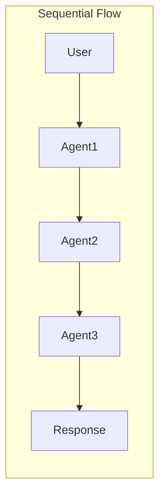
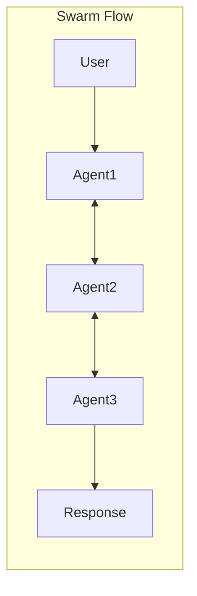
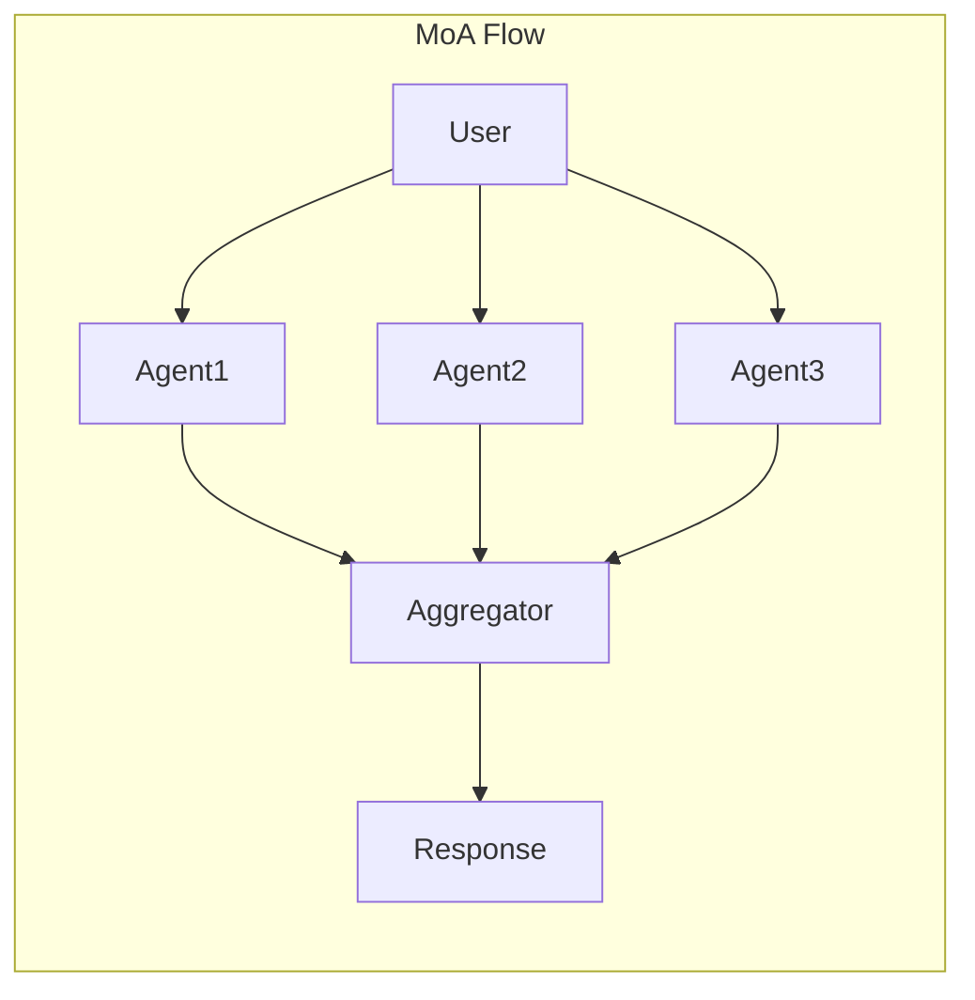

# Core Concepts

This section introduces the core concepts in Pantheon. Understanding these fundamental building blocks will help you effectively use the framework to build sophisticated multi-agent systems.

## Overview

Pantheon is built around several key abstractions that work together to create powerful AI systems:

- **Agents** - AI-powered entities with specific instructions and capabilities
- **Teams** - Collections of agents working together in coordinated patterns
- **Memory** - Systems for persisting information across interactions
- **Toolsets** - Functions and services that extend agent capabilities
- **Endpoints** - Network services for distributed deployment
- **ChatRooms** - Interactive interfaces for agent conversations

---

## Agent

An Agent is the fundamental building block in Pantheon - an AI-powered entity that can understand instructions, use tools, maintain memory, and collaborate with other agents.

### What is an Agent?

An agent in Pantheon is:

- **Autonomous**: Can make decisions and take actions independently
- **Tool-enabled**: Can use various tools to extend its capabilities
- **Stateful**: Maintains context and memory across interactions
- **Collaborative**: Can work with other agents in teams

### Core Components

#### Instructions
Every agent has instructions that define its behavior and personality:

```python
agent = Agent(
    name="researcher",
    instructions="You are an expert researcher. You excel at finding and analyzing information from various sources. Always cite your sources."
)
```


#### Tools and Capabilities
Agents become powerful through tools:

```python
from pantheon.agent import Agent

agent = Agent(name="assistant", instructions="You are helpful.")

# Add custom tools
@agent.tool
def calculate(expression: str) -> float:
    """Evaluate a mathematical expression."""
    return eval(expression)  # In production, use safe evaluation

# Add pre-built toolsets
from pantheon.toolsets.web_browse import duckduckgo_search
agent.tools.append(duckduckgo_search)
```

### Advanced Features

#### Structured Output
Agents can return structured data:

```python
from pydantic import BaseModel

class Analysis(BaseModel):
    summary: str
    sentiment: str
    key_points: list[str]

agent = Agent(
    name="analyzer",
    instructions="Analyze text and return structured data."
)

result = await agent.run(
    messages=[{"role": "user", "content": "Analyze this text..."}],
    response_format=Analysis
)
# result is an Analysis instance
```

#### Remote Agents
Agents can run on remote machines:

```python
# On remote machine
agent = Agent(name="remote_expert", instructions="...")
await agent.serve()  # will print the service id

# On local machine
from pantheon.agent import RemoteAgent
remote_agent = RemoteAgent("your-service-id")
response = await remote_agent.run(messages)
```

---

## Team

Teams in Pantheon enable multiple agents to collaborate on complex tasks. Different team structures support various collaboration patterns, from simple sequential processing to sophisticated multi-agent reasoning.

### What is a Team?

A team is a coordinated group of agents that:

- **Collaborate**: Work together towards a common goal
- **Specialize**: Each agent can focus on specific aspects
- **Communicate**: Share information and context
- **Coordinate**: Follow structured interaction patterns

### Team Types

#### Sequential Team
Agents process tasks in a predefined order, with each agent building on the previous one's output.

**Use Cases:**
- Multi-step workflows
- Progressive refinement
- Pipeline processing

```python
from pantheon.team import SequentialTeam
from pantheon.agent import Agent

researcher = Agent(name="researcher", instructions="Research the topic")
writer = Agent(name="writer", instructions="Write based on research")
editor = Agent(name="editor", instructions="Edit and polish the text")

team = SequentialTeam([researcher, writer, editor])
result = await team.run("Write an article about AI")
```

#### Swarm Team
Agents can dynamically transfer control to each other based on the task requirements.

**Use Cases:**
- Dynamic routing
- Specialized handling
- Flexible workflows

```python
from pantheon.team import SwarmTeam

generalist = Agent(name="generalist", instructions="Handle general queries")
specialist = Agent(name="specialist", instructions="Handle technical queries")

@generalist.tool
def transfer_to_specialist():
    """Transfer complex technical questions to specialist."""
    return specialist

team = SwarmTeam([generalist, specialist])
```

#### SwarmCenter Team
A central coordinator agent manages and delegates tasks to worker agents.

**Use Cases:**
- Task distribution
- Centralized management
- Load balancing

```python
from pantheon.team import SwarmCenterTeam

coordinator = Agent(
    name="coordinator",
    instructions="Analyze tasks and delegate to appropriate workers"
)

workers = [
    Agent(name="analyst", instructions="Perform data analysis"),
    Agent(name="researcher", instructions="Conduct research"),
    Agent(name="writer", instructions="Create content")
]

team = SwarmCenterTeam(coordinator, workers)
```

#### Mixture of Agents (MoA) Team
Multiple agents work on the same problem independently, then their outputs are synthesized.

**Use Cases:**
- Ensemble reasoning
- Diverse perspectives
- Robust solutions

```python
from pantheon.team import MoATeam

agents = [
    Agent(name="expert1", instructions="Approach from perspective A"),
    Agent(name="expert2", instructions="Approach from perspective B"),
    Agent(name="expert3", instructions="Approach from perspective C")
]

aggregator = Agent(
    name="aggregator",
    instructions="Synthesize all responses into the best solution"
)

team = MoATeam(agents, aggregator)
```

### Team Coordination

#### Message Flow
Teams manage message flow between agents:







#### Context Sharing
Teams share context between agents:

```python
class ContextSharingTeam(SequentialTeam):
    async def run(self, messages, context_variables=None):
        # Context is passed between agents
        shared_context = context_variables or {}
        
        for agent in self.agents:
            response = await agent.run(
                messages,
                context_variables=shared_context
            )
            # Update shared context
            shared_context.update(response.context_variables)
            messages = response.messages
        
        return response
```

---

## Memory

Memory systems in Pantheon enable agents to maintain context, learn from interactions, and share knowledge. This persistence is crucial for building agents that can handle complex, multi-turn conversations and collaborative tasks.

### What is Memory?

Memory in Pantheon provides:

- **Persistence**: Information survives beyond single interactions
- **Context**: Agents remember previous conversations
- **Learning**: Agents can accumulate knowledge over time
- **Sharing**: Multiple agents can access common information

TODO


## Toolset

Toolsets extend agent capabilities by providing access to external functions, APIs, and services. They bridge the gap between AI reasoning and real-world actions.

### What is a Toolset?

A toolset is a collection of functions that agents can use to:

- **Execute Code**: Run Python, R, or shell commands
- **Access Information**: Browse web, query databases
- **Manipulate Files**: Read, write, edit files
- **Integrate Services**: Connect to external APIs
- **Perform Computations**: Complex calculations and analysis

### Built-in Toolsets

#### Python Interpreter
Execute Python code in a sandboxed environment:

```python
from pantheon.toolsets.python import PythonInterpreterToolSet
from pantheon.toolsets.utils.toolset import run_toolsets

async def create_python_agent():
    toolset = PythonInterpreterToolSet("python_tool")
    
    async with run_toolsets([toolset]):
        agent = Agent(
            name="data_scientist",
            instructions="You can analyze data with Python."
        )
        await agent.remote_toolset(toolset.service_id)
        
        # Agent can now execute Python code
        await agent.run([{
            "role": "user",
            "content": "Calculate the mean of [1, 2, 3, 4, 5]"
        }])
```

#### Web Browsing
Search and fetch web content:

```python
from pantheon.toolsets.web_browse import (
    duckduckgo_search,
    web_crawl
)

agent = Agent(
    name="researcher",
    instructions="Research topics using web search.",
    tools=[duckduckgo_search, web_crawl]
)
```

### Creating Custom Tools

#### Simple Function Tools
Convert any Python function into a tool:

```python
from pantheon.agent import Agent

agent = Agent(name="calculator", instructions="...")

@agent.tool
def calculate_compound_interest(
    principal: float,
    rate: float,
    time: int,
    n: int = 1
) -> float:
    """Calculate compound interest.
    
    Args:
        principal: Initial amount
        rate: Annual interest rate (as decimal)
        time: Time period in years
        n: Compounding frequency per year
        
    Returns:
        Final amount after compound interest
    """
    return principal * (1 + rate/n) ** (n * time)
```

#### Async Tools
Support for asynchronous operations:

```python
@agent.tool
async def fetch_weather(city: str) -> dict:
    """Fetch current weather for a city."""
    import aiohttp
    
    async with aiohttp.ClientSession() as session:
        url = f"https://api.weather.com/v1/location/{city}"
        async with session.get(url) as response:
            return await response.json()
```

---

## Endpoint

Endpoints in Pantheon enable distributed deployment of agents and toolsets by exposing them as network services. This allows for scalable, modular architectures where components can run on different machines.

### What is an Endpoint?

An endpoint is a network-accessible service that:

- **Exposes Functionality**: Makes agents or tools available over the network
- **Enables Distribution**: Allows components to run on different machines
- **Provides APIs**: Offers standardized interfaces for communication
- **Supports Scaling**: Facilitates horizontal scaling of services

### Types of Endpoints

#### Agent Endpoints
Deploy agents as standalone services:

```python
from pantheon.agent import Agent

# Create and configure agent
agent = Agent(
    name="expert_agent",
    instructions="You are a domain expert.",
    model="gpt-4o"
)

# Start as endpoint service
await agent.start_service(
    host="0.0.0.0",
    port=8000,
    auth_token="secret_token"  # Optional authentication
)

# Access from another machine
from pantheon.remote import RemoteAgent

remote_agent = RemoteAgent(
    "http://agent-server:8000",
    auth_token="secret_token"
)

response = await remote_agent.run(messages)
```

#### Toolset Endpoints
Expose toolsets as services:

```python
from pantheon.toolsets.python import PythonInterpreterToolSet
from pantheon.toolsets.utils.toolset import run_toolset_service

# Create toolset
toolset = PythonInterpreterToolSet("python_service")

# Start as endpoint
await run_toolset_service(
    toolset,
    host="0.0.0.0",
    port=8001
)

# Agent connects to remote toolset
agent = Agent(name="compute_agent", instructions="...")
await agent.remote_toolset("http://toolset-server:8001")
```

### Deployment Patterns

#### Microservices Architecture
Deploy each component as a separate service:

```yaml
# docker-compose.yml
version: '3.8'

services:
  research-agent:
    image: pantheon-agent
    environment:
      AGENT_NAME: researcher
      MODEL: gpt-4o
    ports:
      - "8001:8000"
  
  python-tools:
    image: pantheon-toolset
    environment:
      TOOLSET: python_interpreter
    ports:
      - "8002:8000"
  
  chatroom:
    image: pantheon-chatroom
    environment:
      AGENTS: http://research-agent:8000
      TOOLSETS: http://python-tools:8000
    ports:
      - "8080:8000"
```

---

## ChatRoom

ChatRoom is an interactive service that provides a user-friendly interface for conversations with agents and teams. It manages sessions, handles real-time communication, and integrates with web UIs.

### What is a ChatRoom?

A ChatRoom is a service layer that:

- **Hosts Conversations**: Manages interactive sessions with agents
- **Provides Interface**: Offers web UI and API access
- **Manages State**: Maintains conversation history and context
- **Handles Concurrency**: Supports multiple simultaneous users
- **Enables Persistence**: Saves and restores chat sessions

### Core Features

#### Session Management
ChatRooms manage user sessions automatically:

```python
from pantheon.chatroom import ChatRoom
from pantheon.agent import Agent

# Create ChatRoom with an agent
agent = Agent(
    name="assistant",
    instructions="You are a helpful assistant."
)

chatroom = ChatRoom(
    name="Support ChatRoom",
    agents=[agent],
    max_sessions=100,
    session_timeout=3600  # 1 hour
)

# Start the service
await chatroom.start(port=8000)
```

#### Web UI Integration
Connect to Pantheon's web interface:

```bash
# Start ChatRoom
python -m pantheon.chatroom

# Output shows:
# ChatRoom started with ID: abc123...
# Connect at: https://pantheon-ui.vercel.app/

# Users can then:
# 1. Visit the web UI
# 2. Enter the ChatRoom ID
# 3. Start chatting
```

### Creating ChatRooms

#### Team ChatRoom
ChatRoom with a team of agents:

```python
from pantheon.team import SequentialTeam

# Create specialized agents
researcher = Agent(
    name="researcher",
    instructions="Research and gather information."
)

writer = Agent(
    name="writer",
    instructions="Write clear, engaging content."
)

editor = Agent(
    name="editor",
    instructions="Edit and improve text."
)

# Create team
team = SequentialTeam([researcher, writer, editor])

# Create ChatRoom with team
chatroom = ChatRoom(
    name="Content Creation ChatRoom",
    team=team,
    description="Create high-quality content"
)
```

#### Configuration-based ChatRoom
Create from YAML configuration:

```yaml
# chatroom_config.yaml
name: "Customer Support ChatRoom"
description: "24/7 AI customer support"

agents:
  - name: "greeter"
    instructions: "Greet customers warmly and understand their needs."
    model: "gpt-4o-mini"
    
  - name: "technical_support"
    instructions: "Provide technical assistance and troubleshooting."
    model: "gpt-4o"
    tools:
      - "search_knowledge_base"
      - "create_ticket"

team:
  type: "swarm"
  transfer_functions: true

settings:
  welcome_message: "Welcome! How can I help you today?"
  session_timeout: 1800
  max_message_length: 1000
```

```python
# Load from configuration
chatroom = ChatRoom.from_config("chatroom_config.yaml")
await chatroom.start()
```
